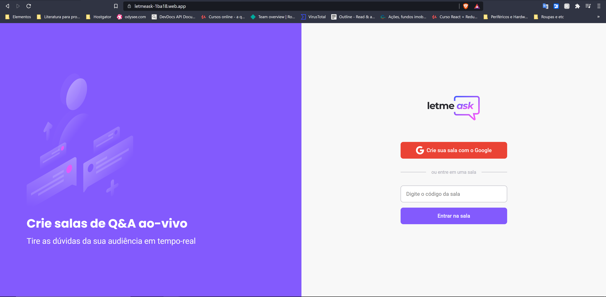
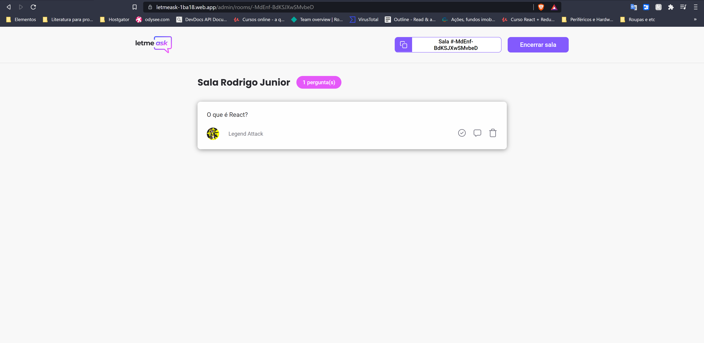
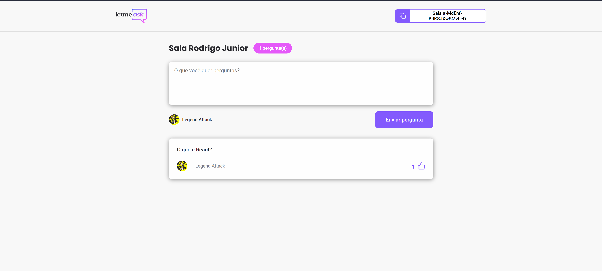

  

  

  

   

  

<h1 align="center">Letmeask<ht>
  
<h4 align="center"> 
	🚧  Letmeask  Concluído 🚀 🚧
</h4>

 <a href="#-sobre-o-projeto">Sobre</a> •
 <a href="#-funcionalidades">Funcionalidades</a> •
 <a href="#-layout">Layout</a> • 
 <a href="#-como-executar-o-projeto">Como executar</a> • 
 <a href="#-tecnologias">Tecnologias</a> • 
 <a href="#-autor">Autor</a> • 

## 💻 Sobre o projeto

  <strong>LetmeAsk</strong> é um projeto que ajuda influenciadores, professores e comunidades a interagirem e evoluir intelectualmente todos juntos. Você pode fazer perguntas especificas sobre um determinado assunto e o criador da sala poderá responde-lo de acordo com os critérios da sala, seja por likes na publicação ou engajamento.

---

## 💻 Funcionalidades

- [✔] Se cadastrar e logar com o Google
- [✔] Criar salas
- [✔] Fazer perguntas e comentários
- [✔] Curtir perguntas
- [✔] Apagar ou destacar perguntas

---

## 🎨 Layout

  
O <strong>Layout</strong> completo está disponível no Figma   

  
   
   

  

    
    
    
  

---

## 🚀🔰 Como executar o projeto

### Pré-requisitos

  Para executar este projeto você precisara de um editor de texto(código). Recomendo a utilização do VSCode por ser mais completo e fácil entendimento. Para baixa-lo <a href="https://code.visualstudio.com/Download">Clique aqui</a>

### Executando o projeto

  

    1. <strong>Clone o projeto</strong>: Abra o terminal na pasta que desejar e digite: <strong style="color: #4361ee;">git clone https://github.com/RodrigoJuniorLiyah/MOVEIT---Rocketseat.git</strong> ou <a href="https://github.com/RodrigoJuniorLiyah/MOVEIT---Rocketseat/archive/main.zip">clique aqui</a> e baixe o projeto diretamente e extraia os arquivos onde desejar.
  

  

    2. <strong>Intale as dependências do projeto</strong>: Com o VSCode aberto abra o terminal com "Ctrl+"(aspas abaixo do Esc)"  com o terminal aberto digite "<strong style="color: #4361ee;">npm install</strong>" ou "<strong style="color: #4361ee;">yarn install</strong>"
  

  
  

    3. <strong>Execute o projeto</strong>: Com o terminal aberto digite "<strong style="color: #4361ee;">npm run dev</strong> ou <strong style="color: #4361ee;">yarn dev</strong>" abra seu navegador e digite "localhost:3000"
  

---

## 🛠 Tecnologias

As seguintes ferramentas foram utilizadas na construção do projeto:

- **[Typescript](https://www.typescriptlang.org/)**
- **[ReactJs](https://reactjs.org/)**

  > Veja o arquivo [package.json](https://github.com/RodrigoJuniorLiyah/Letmeask---Rocketseat/blob/main/package.json)

---

## 💪 Como contribuir para o projeto

1. Faça um **fork** do projeto.
2. Crie uma nova branch com as suas alterações: `git checkout -b my-feature`
3. Salve as alterações e crie uma mensagem de commit contando o que você fez: `git commit -m "feature: My new feature"`
4. Envie as suas alterações: `git push origin my-feature`

> Caso tenha alguma dúvida confira este [guia de como contribuir no GitHub](./CONTRIBUTING.md)

---

## 🐱‍👤 Autor

<b>Rodrigo junior 🚀</b>

 

 

